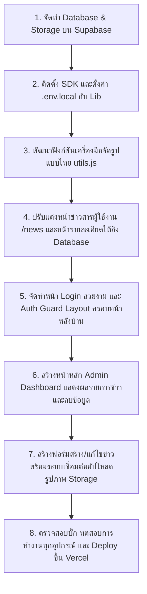

# BRIEF: ออกแบบเว็บวิทยาลัยพณิชยการธนบุรีใหม่ + Backend

> ไฟล์นี้สำหรับวางให้ AI (v0 / Lovable / Claude / Stitch) อ่านเป็น context ของงาน
> เว็บเดิม: https://www.panitthon.ac.th (WordPress — ข้อมูลเยอะแต่ดูรก)

---

## GOAL

ออกแบบและพัฒนาเว็บไซต์วิทยาลัยขึ้นใหม่ให้:
1. **ทันสมัย** — ใช้หลักการออกแบบที่ดี (hierarchy, spacing, typography, color, consistency)
2. **ใช้งานง่าย** — responsive ทุกอุปกรณ์ หาข้อมูลเจอเร็ว
3. **จัดการได้** — เจ้าหน้าที่เพิ่ม/แก้/ลบ ข่าว-เอกสารได้เองผ่านระบบหลังบ้าน (ไม่ต้องแก้โค้ด)

---

## TECH STACK

- **Frontend:** Next.js (App Router, JavaScript ไม่ใช้ TypeScript) + Tailwind CSS + Lucide icons
- **Backend:** Supabase (Database + Auth + Storage)
- **Deploy:** Vercel + GitHub

---

## PAGES (หน้าเว็บ)

### หน้าหลัก (ต้องมี)
| หน้า | เนื้อหา |
|------|---------|
| หน้าแรก (`/`) | Hero + ข่าวเด่น + ทางลัดระบบสารสนเทศ |
| เกี่ยวกับวิทยาลัย (`/about`) | ปรัชญา วิสัยทัศน์ อัตลักษณ์ |
| ข่าวประชาสัมพันธ์ (`/news`) | list ข่าวทั้งหมด |
| รายละเอียดข่าว (`/news/[id]`) | หน้าข่าวเดี่ยว (dynamic route) |
| บุคลากร (`/staff`) | ผู้บริหาร ครู แยกตามฝ่าย |
| แผนกวิชา (`/departments`) | สาขาที่เปิดสอน |
| ติดต่อเรา (`/contact`) | ที่อยู่ แผนที่ เบอร์โทร |

### หน้าเสริม (ถ้ามีเวลา)
ประกาศ/จัดซื้อจัดจ้าง, คลังภาพกิจกรรม, ดาวน์โหลดเอกสาร, รับสมัครนักศึกษา, ปฏิทินการศึกษา, หน้ารวมลิงก์ระบบสารสนเทศ (RMS, ศธ.02, ห้องสมุด ฯลฯ)

### หน้า Admin (backend)
| หน้า | ทำอะไร |
|------|---------|
| Login (`/admin/login`) | เจ้าหน้าที่ login |
| Dashboard (`/admin`) | จัดการข่าว/เอกสาร |
| เพิ่ม/แก้ข่าว (`/admin/news/...`) | CRUD ข่าว |

> **เริ่มจาก 3 หน้าก่อน:** หน้าแรก + ข่าว (list/detail) + เกี่ยวกับ — พอสำหรับโชว์ทั้ง frontend + backend

---

## FRONTEND REQUIREMENTS

- **Navbar** — โลโก้ + เมนูหลัก + responsive (hamburger บนมือถือ)
- **Hero Section** — ภาพ/ชื่อวิทยาลัย + ปุ่มทางลัดสำคัญ
- **ข่าวเด่น** — card ดึงจาก Supabase มาแสดง (ใช้ `.map()`)
- **ทางลัดระบบ** — grid ไอคอนลิงก์ไประบบต่างๆ
- **Footer** — ที่อยู่ ติดต่อ social ลิงก์สำคัญ
- **หน้ารายละเอียดข่าว** — dynamic route ตาม id
- ทุกหน้า **responsive** + ใช้หลักออกแบบ 5 ข้อ

---

## BACKEND REQUIREMENTS (Supabase)

ความสามารถหลัก: **CRUD** (Create / Read / Update / Delete)
- เพิ่มข่าว/เอกสารใหม่
- ดึงข้อมูลมาแสดงบนเว็บ
- แก้ไขข่าวที่มีอยู่
- ลบข่าวเก่า

ระบบที่ควรมี:
- **หน้า Admin** สำหรับจัดการข้อมูล
- **Login** (Supabase Auth) — เฉพาะเจ้าหน้าที่แก้ได้
- **Upload** (Supabase Storage) — แนบรูป/ไฟล์ PDF
- **จัดหมวดหมู่** — ข่าว/ประกาศ/จัดซื้อ

---

## DATABASE SCHEMA

### ตาราง `news`
```sql
id          bigint        primary key (auto)
title       text          -- หัวข้อข่าว
content     text          -- เนื้อหา
category    text          -- ประชาสัมพันธ์ / จัดซื้อ / ประกาศ
image_url   text          -- ลิงก์รูปภาพ
file_url    text          -- ลิงก์ไฟล์แนบ PDF (nullable)
created_at  timestamptz   default now()
```

### ตารางอื่นที่อาจมี
- `staff` — บุคลากร (name, position, department, photo_url)
- `departments` — แผนกวิชา (name, description, icon)
- `documents` — เอกสารดาวน์โหลด (title, category, file_url)
- `links` — ลิงก์ระบบสารสนเทศ (title, url, icon)

---

## DESIGN PRINCIPLES (ใช้ทุกหน้า)

1. **Visual Hierarchy** — สิ่งสำคัญเด่น (ขนาด สี น้ำหนัก)
2. **Spacing** — เว้นช่องให้หายใจ (`py-20`, `gap-6`)
3. **Typography** — ฟอนต์ 1-2 แบบ ลำดับขนาดชัด (ฟอนต์ไทย: Sarabun/Prompt/Kanit)
4. **Color** — 60-30-10, สีหลัก 1 + neutral + สีเน้น 1 (ใช้สีประจำโรงเรียนได้)
5. **Consistency** — ปุ่ม/การ์ด/มุมโค้ง ใช้ค่าเดียวกันทั้งเว็บ

---

## ⚠️ กฎการใช้ AI (ประหยัด Token)

> Free tier มี credit จำกัด + การ debug กิน credit เท่าการสร้างใหม่ ต้องแบ่งงานให้ดี

### ทำเอง (ไม่ใช้ AI) — ประหยัด credit
Navbar, Hero, Footer, About, Card ข่าว (`.map`), แก้สี/spacing/ฟอนต์
→ สิ่งเหล่านี้เขียนเองได้ (เรียนมาแล้ว)

### ใช้ AI — เฉพาะส่วนยาก
Layout ซับซ้อน, Animation, เชื่อม Supabase ครั้งแรก, หน้า Admin/CRUD, Auth, บั๊กที่หาไม่เจอ

### กฎ 5 ข้อ
1. ลองเขียนเองก่อน 10 นาที ค่อยถาม AI
2. 1 คำสั่ง = 1 เรื่อง (อย่าสั่ง "ทำทั้งหน้า")
3. เขียน prompt ชัดครั้งเดียว (ลดการ iterate)
4. copy error เต็มๆ ตอน debug
5. **เก็บ credit ครึ่งหนึ่งไว้ debug**

---

## PHASES

1. **ออกแบบ** — ศึกษาเว็บเดิม, หา reference, ร่าง layout, เลือกสี/ฟอนต์
2. **Frontend** — สร้างหน้าด้วย Next.js + Tailwind (ข้อมูลปลอมก่อน), แยก components, responsive
3. **Backend** — สร้าง Supabase DB, เชื่อมดึงข้อมูลจริง, ทำ admin + login + CRUD
4. **Deploy** — push GitHub → Vercel, ทดสอบ CRUD, นำเสนอ

---

## DELIVERABLES

- [ ] GitHub repo (public)
- [ ] Vercel URL ใช้งานได้จริง
- [ ] Screenshot ก่อน-หลัง (เทียบเว็บเดิม)
- [ ] อธิบายสั้นๆ: ใช้หลักออกแบบไหน + backend ทำอะไรได้

## GRADING
| เกณฑ์ | คะแนน |
|------|-------|
| ออกแบบสวย ใช้หลัก 5 ข้อ | 25% |
| Frontend ครบ + responsive | 25% |
| Backend ทำงานได้ (CRUD) | 25% |
| **อธิบายโค้ดตัวเองได้** | 25% |

> กติกา: ใช้ AI ช่วยได้ แต่ต้องเข้าใจและอธิบายได้ทุกส่วน — อธิบายไม่ได้ = ยังไม่ผ่าน

---

## ตัวอย่าง Prompt สำหรับ AI (แบบประหยัด token)

**❌ กว้างไป (เปลือง):** "ทำเว็บโรงเรียนให้หน่อย"

**✅ ชัด (ประหยัด):**
```
สร้าง Hero section สำหรับเว็บวิทยาลัย:
- ชื่อวิทยาลัย (h1 ใหญ่) + คำโปรยใต้ชื่อ
- ปุ่ม 2 อัน: "ข่าวประชาสัมพันธ์" และ "ติดต่อเรา"
- background gradient สี indigo→purple
- min-h-screen จัดกลาง
- responsive
ใช้ Next.js + Tailwind CSS
```

```
สร้าง component NewsCard รับ props: title, date, image_url, category
- รูปด้านบน, category เป็น badge, title, date
- rounded-xl, shadow, hover:scale-105
ใช้ Tailwind
```

```
เชื่อม Supabase ดึงข้อมูลตาราง news มาแสดงในหน้า /news
- เรียงตาม created_at ล่าสุดก่อน
- map เป็น NewsCard
ใช้ Supabase client ใน Next.js App Router
```


---

# PLAN: เชื่อม Supabase + หน้า Admin จัดการข่าว (ฉบับปรับปรุงละเอียด)

> แผนการดำเนินงานและสถาปัตยกรรมสำหรับเปลี่ยนผ่านระบบข่าวสารจากแบบ Hardcode ไปใช้งาน Supabase (Database, Auth, Storage) พร้อมระบบ Admin จัดการข่าวอย่างเป็นระบบและปลอดภัยตามมาตรฐานระดับมืออาชีพ

---

## สรุปสิ่งที่มีอยู่แล้วและการเปลี่ยนแปลง (Current vs Target State)

| หัวข้อ | สิ่งที่มีอยู่แล้ว (Hardcoded) | สิ่งที่จะเป็นหลังเชื่อม Supabase | ไฟล์ที่เกี่ยวข้อง / สร้างใหม่ |
|:---|:---|:---|:---|
| **แหล่งข้อมูล** | `app/data/schoolData.js` (`newsData` array) | ดึงแบบ Dynamic จากตาราง `news` ใน Supabase | `app/lib/supabase.js` [NEW] |
| **หน้ารวมข่าว** | `app/news/page.js` (Client Component) | **Server Component** (Fetch data) + **Client UI** (Search & Filter) | `app/news/page.js` [MODIFY]<br>`app/news/NewsListClient.js` [NEW] |
| **รายละเอียดข่าว** | `app/news/[id]/page.js` (ใช้ข้อมูลจำลองตาม ID) | ดึงข้อมูลข่าวตาม `id` จาก Supabase แบบเรียลไทม์ / ISR | `app/news/[id]/page.js` [MODIFY] |
| **ข่าวเด่นหน้าแรก** | `app/page.js` (กรองข่าวที่มี `featured: true`) | ดึงข้อมูลข่าวที่มีฟิลด์ `featured = true` ล่าสุด 3 ข่าว | `app/page.js` [MODIFY] |
| **เครื่องมือจัดการ** | ไม่มีระบบหลังบ้าน (ต้องแก้ไขโค้ดเมื่อต้องการเปลี่ยนข่าว) | ระบบหลังบ้านสำหรับ Login และระบบจัดการข่าวสารแบบ CRUD | โฟลเดอร์ `app/admin/` [NEW] (ทั้งหมด) |

---

## ขั้นตอนที่ 1 — ออกแบบและตั้งค่าฐานข้อมูล Supabase

### 1.1 สร้างตาราง `news` บน Supabase (SQL Editor)

เปิด Supabase Dashboard → เลือกโปรเจกต์ → ไปที่ **SQL Editor** → สร้าง Query ใหม่แล้ววางคำสั่ง SQL ด้านล่างนี้เพื่อสร้างตารางและเปิดใช้งานสิทธิ์การเข้าถึงข้อมูลอย่างปลอดภัย (RLS):

```sql
-- 1. สร้างตารางข่าว (news)
create table if not exists public.news (
  id          bigserial     primary key,
  title       text          not null,
  summary     text          not null,
  content     text          not null,
  category    text          default 'admission' check (category in ('admission', 'academic', 'activity')),
  image_url   text          not null,
  file_url    text,         -- สำหรับแนบไฟล์ PDF ประชาสัมพันธ์เพิ่มเติม (ถ้ามี)
  featured    boolean       default false,
  views       integer       default 0,
  created_at  timestamptz   default now()
);

-- 2. เปิดใช้งาน Row Level Security (RLS) เพื่อป้องกันความปลอดภัยของข้อมูล
alter table public.news enable row level security;

-- 3. สร้างนโยบายความปลอดภัย (RLS Policies)
-- Policy 3.1: ทุกคน (รวมถึงผู้ใช้ทั่วไปที่ไม่ได้ล็อกอิน) สามารถดึงข้อมูลไปแสดงผลได้ (Select)
create policy "Public can read news"
  on public.news for select
  using (true);

-- Policy 3.2: เฉพาะผู้ใช้ที่ผ่านการยืนยันตัวตน (Authenticated) เท่านั้นที่สามารถเพิ่มข่าวใหม่ได้ (Insert)
create policy "Authenticated users can insert news"
  on public.news for insert
  with check (auth.role() = 'authenticated');

-- Policy 3.3: เฉพาะผู้ใช้ที่ผ่านการยืนยันตัวตน (Authenticated) เท่านั้นที่สามารถแก้ไขข่าวได้ (Update)
create policy "Authenticated users can update news"
  on public.news for update
  using (auth.role() = 'authenticated');

-- Policy 3.4: เฉพาะผู้ใช้ที่ผ่านการยืนยันตัวตน (Authenticated) เท่านั้นที่สามารถลบข่าวได้ (Delete)
create policy "Authenticated users can delete news"
  on public.news for delete
  using (auth.role() = 'authenticated');
```

### 1.2 เพิ่มข้อมูลข่าวประชาสัมพันธ์เริ่มต้น (Seed Data)

รันคำสั่ง SQL ด้านล่างใน SQL Editor เพื่อเพิ่มข้อมูลจำลองสำหรับเริ่มต้นทดสอบระบบ:

```sql
insert into public.news (title, summary, content, category, image_url, featured, views) values
  ('วิทยาลัยพณิชยการธนบุรี เปิดรับสมัครนักศึกษาใหม่ ระดับ ปวช. และ ปวส. ประจำปีการศึกษา 2570',
   'เปิดรับสมัครนักเรียนนักศึกษารอบโควตา และรอบทั่วไป ในหลากหลายแผนกวิชา พร้อมรับสิทธิประโยชน์เพียบ!',
   'วิทยาลัยพณิชยการธนบุรี มีความยินดีที่จะประกาศเปิดรับสมัครบุคคลเข้าศึกษาต่อในระดับประกาศนียบัตรวิชาชีพ (ปวช.) และระดับประกาศนียบัตรวิชาชีพชั้นสูง (ปวส.) ประจำปีการศึกษา 2570 ทั้งประเภทวิชาบริหารธุรกิจ การท่องเที่ยว และเทคโนโลยีสารสนเทศ 
   
   แผนกวิชาที่เปิดรับสมัคร:
   1. แผนกวิชาการบัญชี
   2. แผนกวิชาการตลาด
   3. แผนกวิชาเทคโนโลยีธุรกิจดิจิทัล
   4. แผนกวิชาการท่องเที่ยว
   5. แผนกวิชาการจัดการโลจิสติกส์
   
   สอบถามข้อมูลเพิ่มเติมได้ที่ งานทะเบียน อาคาร 7 ชั้น 1 วิทยาลัยพณิชยการธนบุรี ในวันและเวลาราชการ',
   'admission',
   'https://images.unsplash.com/photo-1523050854058-8df90110c9f1?w=800',
   true, 1240),
  ('TCC คว้ารางวัลชนะเลิศการประกวดสิ่งประดิษฐ์คนรุ่นใหม่ ระดับชาติ ประจำปี 2569',
   'ทีมนักศึกษาสาขาเทคโนโลยีธุรกิจดิจิทัล คว้ารางวัลระดับประเทศ จากการพัฒนาแอปพลิเคชันระบบส่งเสริมการท่องเที่ยวชุมชน',
   'วิทยาลัยพณิชยการธนบุรี ขอแสดงความยินดีกับคณะครูผู้ควบคุมและนักศึกษาสาขาวิชาเทคโนโลยีธุรกิจดิจิทัล ที่คว้ารางวัลชนะเลิศอันดับ 1 ในการประกวด "สิ่งประดิษฐ์ของคนรุ่นใหม่" ระดับชาติ จากผลงานแอปพลิเคชัน TCC LocalTravel นำเที่ยวชุมชนฝั่งธนบุรีเชิงอนุรักษ์โดยการผสมผสานระบบ AI ช่วยเหลือนักท่องเที่ยว',
   'academic',
   'https://images.unsplash.com/photo-1427504494785-3a9ca7044f45?w=800',
   true, 980),
  ('กิจกรรมกีฬาสีภายใน พิกุลเกมส์ ประจำปีการศึกษา 2569',
   'งานกีฬาสีภายในเพื่อเสริมสร้างความสามัคคีและสุขภาพพลานามัยที่แข็งแรงให้แก่นักเรียนนักศึกษา ณ สนามกีฬากลาง',
   'วิทยาลัยพณิชยการธนบุรีได้จัดการแข่งขันกีฬาภายใน พิกุลเกมส์ ประจำปีการศึกษา 2569 ขึ้นอย่างยิ่งใหญ่ โดยมีการจัดขบวนพาเหรดที่สะท้อนถึงวัฒนธรรมและการอนุรักษ์สิ่งแวดล้อม พร้อมด้วยการแข่งขันกรีฑาและกีฬาสากลประเภทต่างๆ เพื่อเชื่อมความสัมพันธ์ระหว่างรุ่นพี่และรุ่นน้องในสถาบัน',
   'activity',
   'https://images.unsplash.com/photo-1517649763962-0c623066013b?w=800',
   false, 450);
```

### 1.3 ตั้งค่าพื้นที่เก็บข้อมูลรูปภาพข่าว (Supabase Storage)

1. ไปที่เมนู **Storage** ในหน้า Supabase Dashboard
2. กดปุ่ม **New Bucket** เพื่อสร้างพื้นที่เก็บข้อมูลรูปภาพข่าว:
   - **Bucket Name:** `news-images`
   - **Public Bucket:** ✅ **เปิดใช้งาน (Enabled)** (เพื่อให้บุคคลภายนอกสามารถดูรูปภาพได้โดยไม่ต้องมี Token)
3. กำหนดสิทธิ์ความปลอดภัยด้วย SQL (หรือผ่านอินเตอร์เฟซ Dashboard):

```sql
-- นโยบายเพื่อให้ใครก็ได้เปิดอ่านรูปภาพได้
create policy "Public read images"
  on storage.objects for select
  using (bucket_id = 'news-images');

-- นโยบายให้เฉพาะ Admin ที่ล็อกอินแล้วสามารถอัปโหลดรูปภาพได้
create policy "Auth users upload images"
  on storage.objects for insert
  with check (bucket_id = 'news-images' and auth.role() = 'authenticated');

-- นโยบายให้เฉพาะ Admin ที่ล็อกอินแล้วสามารถลบรูปภาพได้
create policy "Auth users delete images"
  on storage.objects for delete
  using (bucket_id = 'news-images' and auth.role() = 'authenticated');
```

---

## ขั้นตอนที่ 2 — ติดตั้งและเริ่มใช้งาน Supabase Client

### 2.1 ติดตั้ง Supabase SDK

เปิด Terminal ของโปรเจกต์และรันคำสั่งติดตั้งตัวช่วยเชื่อมต่อ:
```bash
npm install @supabase/supabase-js
```

### 2.2 จัดการคีย์ความปลอดภัย (.env.local)

ตรวจสอบว่าไฟล์ `.env` มีค่าตัวแปรเหล่านี้ครบถ้วน และเปลี่ยนชื่อไฟล์เป็น `.env.local` เพื่อให้ Next.js โหลดคีย์เข้าโปรเจกต์อย่างปลอดภัย โดยห้ามนำขึ้น Git (มีคีย์เหล่านี้ระบุไว้แล้วในไฟล์ปัจจุบัน)

```env
NEXT_PUBLIC_SUPABASE_URL=https://tmvzyenmxzahlyycfgml.supabase.co
NEXT_PUBLIC_SUPABASE_ANON_KEY=eyJhbGciOiJIUzI1NiIsInR5cCI6IkpXVCJ9...
```

### 2.3 สร้าง Supabase Client Module (`app/lib/supabase.js`) [NEW]

สร้างไฟล์สำหรับเรียกใช้งาน Supabase Client ในแบบ Singleton เพื่อเชื่อมต่อฐานข้อมูลจากหน้าบ้านหรือเซิร์ฟเวอร์ย่อย:

```js
// app/lib/supabase.js
import { createClient } from '@supabase/supabase-js'

const supabaseUrl = process.env.NEXT_PUBLIC_SUPABASE_URL
const supabaseAnonKey = process.env.NEXT_PUBLIC_SUPABASE_ANON_KEY

if (!supabaseUrl || !supabaseAnonKey) {
  console.error("กรุณาตั้งค่าตัวแปรสภาพแวดล้อม Supabase ในไฟล์ .env.local")
}

export const supabase = createClient(supabaseUrl, supabaseAnonKey)
```

### 2.4 ฟังก์ชันแปลงข้อมูลเพื่อการแสดงผลภาษาไทย (`app/lib/utils.js`) [NEW]

เนื่องจากข้อมูลดิบในฐานข้อมูลจะมีบางส่วนที่ใช้สำหรับระบุตรรกะหลังบ้าน (เช่น ประเภทข่าวรหัสภาษาอังกฤษ หรือวันเวลาที่เป็น ISO String) เราจำเป็นต้องสร้างไฟล์เครื่องมือช่วยจัดรูปแบบเพื่อนำไปแสดงผลบนหน้าต่าง ๆ ได้อย่างถูกต้องและสม่ำเสมอ:

```js
// app/lib/utils.js

// แปลงภาษาของหมวดหมู่ข่าวสาร
export function getCategoryName(category) {
  const categories = {
    admission: 'ข่าวรับสมัคร',
    academic: 'ข่าววิชาการ',
    activity: 'ข่าวกิจกรรม'
  };
  return categories[category] || 'ข่าวประชาสัมพันธ์';
}

// แปลงรูปแบบวันเวลาของระบบเป็นรูปแบบไทย เช่น 5 ก.ค. 2569
export function formatDate(dateString) {
  if (!dateString) return '';
  const date = new Date(dateString);
  return date.toLocaleDateString('th-TH', {
    day: 'numeric',
    month: 'short',
    year: 'numeric'
  });
}
```

---

## ขั้นตอนที่ 3 — ปรับปรุงระบบ Frontend เพื่อดึงข้อมูลจริงจาก Supabase

### 3.1 หน้ารวมข่าวสาร (`app/news/page.js`) [MODIFY]

ปรับหน้าข่าวสารหลักให้เป็น **async Server Component** เพื่อดึงข้อมูลข่าวสารล่าสุดจากฐานข้อมูลโดยตรง ทำให้โหลดหน้าเว็บได้รวดเร็วและเหมาะสำหรับการค้นหาโดย Search Engine (SEO) จากนั้นส่งข้อมูลไปยัง Client Component เพื่อใช้คัดกรองข้อมูลต่อไป:

```js
// app/news/page.js
// นำ "use client" ด้านบนสุดออกเพื่อให้กลายเป็น Server Component
import { supabase } from '../lib/supabase'
import NewsListClient from './NewsListClient'

export const dynamic = 'force-dynamic' // บังคับให้ดึงข้อมูลใหม่ทุกครั้งที่ผู้ใช้เข้าหน้านี้

export default async function NewsPage() {
  const { data: news, error } = await supabase
    .from('news')
    .select('*')
    .order('created_at', { ascending: false })

  if (error) {
    console.error("Error fetching news:", error)
    return (
      <main className="min-h-screen bg-slate-50 flex items-center justify-center">
        <p className="text-rose-500 font-semibold text-lg">เกิดข้อผิดพลาดในการดึงข้อมูลข่าวสาร กรุณาลองใหม่อีกครั้ง</p>
      </main>
    )
  }

  return <NewsListClient initialNews={news || []} />
}
```

### 3.2 สร้างไฟล์แยกตัวกรองข่าว (`app/news/NewsListClient.js`) [NEW]

ย้ายโค้ดการทำงานฝั่งผู้ใช้งาน (Search, Tab selection, UI interaction) มาไว้ที่ไฟล์นี้ โดยรับตัวแปรข่าวสารตั้งต้นมาประมวลผล:

```js
// app/news/NewsListClient.js
"use client";

import { useState } from "react";
import Link from "next/link";
import { getCategoryName, formatDate } from "../lib/utils";

export default function NewsListClient({ initialNews }) {
  const [searchTerm, setSearchTerm] = useState("");
  const [selectedCategory, setSelectedCategory] = useState("all");

  const categories = [
    { id: "all", name: "ทั้งหมด" },
    { id: "admission", name: "ข่าวรับสมัคร" },
    { id: "academic", name: "ข่าววิชาการ" },
    { id: "activity", name: "ข่าวกิจกรรม" },
  ];

  // กรองข่าวจากคำค้นหาและหมวดหมู่ที่คลิกเลือก
  const filteredNews = initialNews.filter((item) => {
    const matchesSearch =
      item.title.toLowerCase().includes(searchTerm.toLowerCase()) ||
      (item.summary && item.summary.toLowerCase().includes(searchTerm.toLowerCase()));
    
    const matchesCategory = selectedCategory === "all" || item.category === selectedCategory;
    return matchesSearch && matchesCategory;
  });

  return (
    <main className="min-h-screen bg-slate-50 py-12">
      {/* ส่วนหัวหน้าเว็บและแถบค้นหาทำตามดีไซน์เดิม */}
      {/* ... (อิงโค้ด HTML/CSS ใน app/news/page.js เดิมแต่เปลี่ยนตัวแปรวนลูปเป็น filteredNews) ... */}
      
      {/* ตัวอย่างการวนลูปการ์ดข่าว (ปรับโครงสร้างฟิลด์ให้รับจาก Supabase) */}
      {/*
        item.image -> เปลี่ยนเป็น item.image_url
        item.categoryName -> เปลี่ยนเป็น getCategoryName(item.category)
        item.date -> เปลี่ยนเป็น formatDate(item.created_at)
      */}
    </main>
  );
}
```

### 3.3 หน้ารายละเอียดข่าวประชาสัมพันธ์ (`app/news/[id]/page.js`) [MODIFY]

เปลี่ยนไปดึงข้อมูลเดี่ยวผ่าน Supabase:
```js
// app/news/[id]/page.js
import Link from "next/link";
import { supabase } from "../../lib/supabase";
import { getCategoryName, formatDate } from "../../lib/utils";

export const dynamic = 'force-dynamic';

export default async function NewsDetailPage({ params }) {
  const { id } = await params;

  // ดึงข้อมูลข่าวสารตามไอดี
  const { data: newsItem, error } = await supabase
    .from('news')
    .select('*')
    .eq('id', id)
    .single();

  if (error || !newsItem) {
    // แสดง UI แจ้งเตือนไม่พบข้อมูลข่าวสาร (เหมือนโค้ดเดิม)
  }

  // ดึงข่าวอื่นๆ เพื่อไปแสดงในแถบข้าง (Side Bar) ยกเว้นข่าวที่เปิดอ่านอยู่
  const { data: otherNews } = await supabase
    .from('news')
    .select('*')
    .ne('id', id)
    .order('created_at', { ascending: false })
    .limit(3);

  // แยกบรรทัดของเนื้อหามาจัดพารากราฟ
  const paragraphs = newsItem.content.split("\n").filter((p) => p.trim() !== "");

  return (
    // แสดงหน้า UI ของข่าวสารเดิม โดยแทนที่:
    // newsItem.image -> newsItem.image_url
    // newsItem.categoryName -> getCategoryName(newsItem.category)
    // newsItem.date -> formatDate(newsItem.created_at)
  );
}
```

### 3.4 หน้าแรกของวิทยาลัย (`app/page.js`) [MODIFY]

ดึงเฉพาะข่าวเด่นที่เลือกให้เป็น Featured และเรียงจากวันที่สร้างล่าสุด:
```js
// app/page.js
// เปลี่ยนฟังก์ชัน Home เป็น async เพื่อรองรับการดึงข้อมูลบนเซิร์ฟเวอร์
import { supabase } from "./lib/supabase";
import { getCategoryName, formatDate } from "./lib/utils";

export const dynamic = 'force-dynamic';

export default async function Home() {
  // ดึงข้อมูลข่าวสารแนะนำ 3 ข่าวแรก
  const { data: featuredNews } = await supabase
    .from('news')
    .select('*')
    .eq('featured', true)
    .order('created_at', { ascending: false })
    .limit(3);

  return (
    // ทำงานเหมือนโครงสร้าง HTML/CSS หน้าแรกหลักที่มีอยู่
    // วนลูปข้อมูลการ์ดข่าวด้วยตัวแปร featuredNews และจัดฟอร์แมตข้อมูลตามแบบหน้า /news
  );
}
```

---

## ขั้นตอนที่ 4 — พัฒนาระบบระบบจัดการข้อมูลหลังบ้าน (Admin CRUD Panel)

เพื่อความพรีเมียมและสวยงามตามข้อกำหนด หน้าล็อกอินและหน้าแดชบอร์ดของผู้ดูแลระบบจะใช้โทนสีเดียวกับวิทยาลัย (กรมท่าทอง-ขาว) พร้อมด้วยการจัดการสถานะความปลอดภัยที่แน่หนา

### 4.1 แฟ้มโครงสร้างหน้า Admin ที่จะสร้างขึ้น

```
app/admin/
├── layout.js            ← จัดการตรวจสอบสถานะการเข้าสู่ระบบ (Auth Guard + Admin Navbar)
├── page.js              ← แดชบอร์ดแสดงผลรายการข่าวสารทั้งหมด ปุ่มสร้าง/แก้ไข/ลบข่าว
├── login/
│   └── page.js          ← ฟอร์มเข้าสู่ระบบโดยใช้ Email / Password
└── news/
    ├── new/
    │   └── page.js      ← ฟอร์มกรอกข้อมูลข่าวสารใหม่ อัปโหลดไฟล์รูปภาพเข้า Bucket
    └── [id]/
        └── page.js      ← ฟอร์มดึงข้อมูลข่าวสารเดิมมาแสดงเพื่ออัปเดตข้อมูลย้อนหลัง
```

### 4.2 หน้าจอล็อกอินผู้ดูแลระบบ (`app/admin/login/page.js`) [NEW]

ใช้รูปแบบกระจกฝ้า (Glassmorphism) และเอฟเฟกต์ไล่สีพรีเมียมสำหรับการกรอกข้อมูลเข้าสู่ระบบ:

- **หน้าตาระบบ:** จัดวางกล่องข้อมูลตรงกลางหน้าจอ พื้นหลังไล่สีสวยงามเฉดฟ้ากรมท่า มีการแจ้งเตือน Error ที่ชัดเจน
- **เทคโนโลยี:** ใช้ `"use client"` ร่วมกับ `supabase.auth.signInWithPassword()` เมื่อเข้าสู่ระบบสำเร็จให้ผลักผู้ใช้งานไปหน้าหลัก `/admin` ด้วย `router.push('/admin')`

### 4.3 โครงสร้างเลย์เอาต์การป้องกันการบุกรุกหน้าแดชบอร์ด (`app/admin/layout.js`) [NEW]

- **การทำงาน:** เป็นหน้าหลักที่ใช้จัดการสิทธิ์ผู้เข้าใช้งาน (Auth Guard) โดยจะดึงค่า `getSession` ในฟังก์ชัน `useEffect` หากตรวจสอบแล้วไม่พบการเข้าระบบ จะเปลี่ยนทิศทางไปยังหน้า `/admin/login` ทันที
- **สุนทรียภาพทางดีไซน์:** ระหว่างทำการโหลดหรือส่งค่าคำขอ จะต้องแสดงสถานะหมุนสปินเนอร์หรือ Skeleton สวยงามเพื่อไม่ให้หน้าข้อมูลของแผงควบคุมหลังบ้านกะพริบขึ้นมาก่อนการยืนยันตัวตนเสร็จสิ้น พร้อมแถบเมนูด้านบนที่มีปุ่มแสดงชื่อผู้ดูแลและปุ่มออกจากระบบ (Log out)

### 4.4 หน้าแดชบอร์ดจัดการข่าวสาร (`app/admin/page.js`) [NEW]

หน้าจอส่วนนี้ทำหน้าที่เป็นแผงควบคุมหลักในการจัดการข่าวทั้งหมด:

- **องค์ประกอบหน้าเว็บ:**
  - เมนูเพิ่มข่าวใหม่ปุ่มสีน้ำเงินกรมท่าขอบมน สะดุดตา
  - ตารางแสดงผลรายการข่าวสารที่จัดเรียงแถวสวยงาม รองรับ Responsive (ปัดแถวเลื่อนขวาบนจอมือถือ)
  - ป้ายระบุหมวดหมู่ตามสีประจำกลุ่ม (เช่น ข่าวรับสมัครสีเขียว ข่าววิชาการสีน้ำเงิน ข่าวกิจกรรมสีส้ม)
  - สวิตช์สลับปิด/เปิดสถานะ **ข่าวเด่น (Featured)** บนแถบรายการ ซึ่งจะสลับค่าแบบไร้ความหน่วงและเก็บลงดาต้าเบสทันที
  - ปุ่มแก้ไขข่าวและลบข่าว
- **UX/UI พรีเมียม (Optimistic UI):** เมื่อแอดมินคลิก "ลบข่าว" ระบบจะซ่อนแถวนั้นออกจากหน้าจอก่อนจะทำการส่งคำขอและรอผลลัพธ์จากเซิร์ฟเวอร์เสร็จสิ้น ทำให้แอดมินรู้สึกว่าระบบทำงานรวดเร็วทันใจ ไม่มีอาการกระตุก

### 4.5 หน้าเขียนข่าวใหม่พร้อมระบบอัปโหลดรูปภาพ (`app/admin/news/new/page.js`) [NEW]

ฟอร์มกรอกข้อมูลประกอบด้วย หัวข้อข่าว, คำโปรยย่อ, เนื้อหาแบบกล่องพิมพ์ขนาดใหญ่, ประเภทข่าว, การเปิดข่าวเด่น และช่องเลือกรูปภาพ:

- **การอัปโหลดไฟล์ (Supabase Storage Integration):**
  - เมื่อผู้ดูแลทำการเลือกไฟล์รูปภาพ ระบบจะตรวจขนาดไฟล์ไม่ให้เกิน 5MB และชนิดของภาพ
  - ก่อนทำการอัพโหลด จะส่งไฟล์ไปยัง Bucket `news-images` โดยตั้งชื่อไฟล์เป็นรหัสเวลาที่ไม่ซ้ำซ้อนกันเพื่อป้องกันการเขียนทับ (เช่น `news_1783232.png`)
  - นำผลลัพธ์ลิงก์ภาพแบบเปิดสาธารณะ (Public URL) ที่ได้จาก Supabase มาบรรจุเข้าฟิลด์ `image_url` และบันทึกลงตารางข่าวรวมกัน
- **การแจ้งเตือน (Toasts / Feedback):** มีกล่องข้อความเตือนหรือการแสดงผลความคืบหน้าการอัปโหลดรูปภาพ และแสดงความสำเร็จเมื่อทำการเพิ่มข่าวเสร็จสิ้นพร้อมปิดหน้านั้นกลับไปที่หน้าแดชบอร์ดโดยอัตโนมัติ

### 4.6 หน้าแก้ไขข่าวสารย้อนหลัง (`app/admin/news/[id]/page.js`) [NEW]

- **การทำงาน:** หน้าจอนี้ดึงข้อมูลข่าวสารเก่ามาพรีฟิล (Prefill) ใส่ลงในฟิลด์ต่าง ๆ ให้โดยอัตโนมัติเพื่อความสะดวก
- **การจัดการรูปภาพเดิม:** แสดงกรอบตัวอย่างรูปภาพรูปเก่าที่เคยใช้งาน หากผู้ดูแลต้องการเปลี่ยนรูปภาพใหม่สามารถอัปโหลดทับได้ ซึ่งระบบจะลบไฟล์เก่าในระบบ Storage ออกก่อนเพื่อไม่ให้เกิดขยะพื้นที่จัดเก็บโดยไม่จำเป็น แล้วจัดเก็บ URL ใหม่ลงไปแทน

---

## ขั้นตอนที่ 5 — ลำดับการดำเนินงานการติดตั้ง (Execution Roadmap)



---

## จุดสำคัญที่ต้องทำความเข้าใจและเตรียมตอบคำถามอาจารย์

1. **Row Level Security (RLS) ทำงานอย่างไรในโปรเจกต์นี้?**
   - *คำตอบ:* ตาราง `news` ถูกล็อกไม่ให้ใครส่งคำสั่งแก้ไขข้อมูลได้ยกเว้นจะมีสิทธิ์ความปลอดภัยที่กำหนดไว้ นโยบายที่เราสร้างกำหนดให้คนภายนอกทั่วไปอ่านข่าวได้อย่างเดียว (SELECT) แต่หากจะสร้าง แก้ไข หรือลบ (INSERT, UPDATE, DELETE) จะต้องเป็นผู้ใช้ที่ผ่านระบบยืนยันตัวตน (Authenticated) ผ่านสิทธิ์ของ Supabase Auth เท่านั้น
2. **ทำไมต้องแยกการทำงานเป็น Server Component และ Client Component ในหน้าข่าวสาร?**
   - *คำตอบ:* หน้าหลัก `/news/page.js` ทำหน้าที่ดึงข้อมูลจากฐานข้อมูลของ Supabase โดยตรงที่ฝั่งเซิร์ฟเวอร์ (Server Component) เพื่อให้ประมวลผลได้รวดเร็วและดีต่อหลัก SEO ของหน้าข่าวสารโรงเรียน จากนั้นจึงส่งผ่านข้อมูลลงมาที่ `NewsListClient.js` ซึ่งเป็น Client Component เพื่อทำระบบค้นหา (Search) และแบ่งกลุ่มหน้าข่าวที่ผู้ใช้คลิกเลือก เนื่องจากฟังก์ชันเหล่านี้ต้องพึ่งพา State และตัวจับกิจกรรมต่าง ๆ ในเบราว์เซอร์
3. **การออกแบบให้มีความพรีเมียม (Rich Aesthetics) ในส่วนของระบบดูแลหลังบ้านสะท้อนออกมาอย่างไรบ้าง?**
   - *คำตอบ:* หน้าเว็บ Admin เลือกใช้เฉดสีน้ำเงินและสีกรมท่าที่ดูเป็นทางการและหรูหราควบคู่ไปกับสีเหลืองทองของทางสถาบัน มีการใส่เอฟเฟกต์เงาและการเปลี่ยนผ่านที่เรียบเนียน (Smooth transitions), มีการระบุ Loading states ด้วยสปินเนอร์สวยงามป้องกันเนื้อหาแผงผังกระตุก, สลับปิดเปิดข่าวแนะนำได้ทันทีโดยไม่ต้องรอโหลดหน้าใหม่, และมีกล่องแสดงข้อความผลลัพธ์ของการทำรายการแบบ Toast เพื่อไม่ให้กระทบต่อประสบการณ์ใช้งานของผู้ใช้
4. **ความแตกต่างระหว่าง .env กับ .env.local คืออะไร?**
   - *คำตอบ:* ไฟล์ `.env.local` ถูกพัฒนาขึ้นมาสำหรับใช้งานเป็นการภายในเครื่องคอมพิวเตอร์ปัจจุบันของนักพัฒนาเท่านั้น ซึ่ง Next.js จะโหลดข้อมูลค่าเหล่านั้นมาให้โดยอัตโนมัติ โดยไฟล์นี้จะไม่ถูกบันทึกขึ้นไปอยู่ในที่จัดเก็บรหัสบน GitHub (เนื่องจากระบุไว้ใน `.gitignore`) ซึ่งช่วยป้องกันการรั่วไหลของคีย์ลับในการจัดการระบบของวิทยาลัยออกไปสู่บุคคลภายนอก
